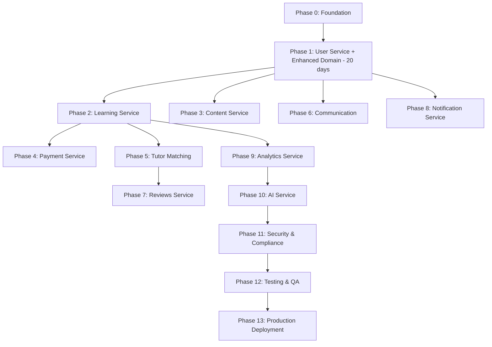

# EdTech Platform Implementation Plan - Updated for GraphQL Federation

## Overview

This implementation plan reflects our **GraphQL Federation** architecture with AWS AppSync as the supergraph and microservices providing subgraphs, using **DDD + Clean Architecture + Use Case Pattern**.

**📅 PHASE REVIEW COMPLETED**: All phases (0-13) have been comprehensively reviewed and updated to ensure consistency with our latest architectural decisions including:

- ✅ **Phase Numbering**: Clean numeric sequence from 0-13 with all duplicates removed
- ✅ **Presentation Layer**: Renamed from "interfaces" to "presentation"
- ✅ **Unified DTO Approach**: Clear separation between use case request/response and API DTOs
- ✅ **GraphQL Architecture**: Central Lambda resolvers + microservice subgraphs clarified
- ✅ **Expanded Infrastructure**: Complete infrastructure component mapping per service
- ✅ **Use Case Pattern**: Consistent implementation across all services
- ✅ **Domain Events**: Proper event handling and side effects management

## Architecture Summary

### GraphQL Federation Pattern

- **Supergraph**: AWS AppSync (unified GraphQL API)
- **Subgraphs**: Each microservice defines its domain schema
- **Resolvers**: Lambda functions call internal microservice APIs
- **Internal APIs**: HTTP REST with `/internal` prefix

### Core Architectural Decisions

- ❌ **No CQRS Pattern** - Use Case pattern with `.usecase.ts` suffix
- ✅ **DDD + Clean Architecture** - Domain-driven with layered approach
- ✅ **NestJS CQRS Integration** - AggregateRoot, events, and sagas
- ✅ **Expanded Infrastructure** - Specific components per service type
- ✅ **Standardized Folder Structure** - Complete microservice organization

### Implementation Phases

## Phase 0: Foundation ✅ COMPLETED

**Duration: 10 days | Status: COMPLETE**

- ✅ Project setup and monorepo structure
- ✅ AWS CDK infrastructure (Network, SharedServices, UserService stacks)
- ✅ Development environment and tooling
- ✅ Clean microservices architecture established
- ✅ Shared libraries with `@edtech/*` imports
- ✅ IUseCase interface and architectural patterns

## Phase 1: GraphQL Federation Foundation & User Service

**Duration: 20 days | Status: READY TO START**

### 1.1 GraphQL Federation Setup (4 days)

- **GraphQL Composition Tooling**
  - Set up Apollo Federation composition
  - Create schema composition pipeline
  - Implement subgraph validation
  - Set up schema registry for schema evolution
- **AppSync Infrastructure (CDK)**
  - Create AppSync GraphQL API stack
  - Configure Cognito authentication
  - Set up basic resolvers infrastructure
  - Implement error handling patterns

### 1.2 User Service Complete Implementation (12 days)

- **Basic Domain Layer Implementation** (2 days) ✅ COMPLETED
  - User entity (AggregateRoot) with NestJS CQRS integration
  - Core value objects: Email, UserId, UserName, UserRole
  - Basic domain events: Created, Updated, Activated, Deactivated
  - Repository interfaces and UserFactory
- **Enhanced Domain Layer Implementation** (4 days) _(NEW - Phase 0.5 Integration)_
  - Domain Services: UserDomainService with complex business logic
  - Business Rules: Centralized UserBusinessRules and policies
  - Specifications Pattern: Composable query logic and business rules
  - Enhanced Value Objects: UserPreferences, UserProfile
  - Advanced Domain Events: Role changes, profile updates, security events
  - Domain-specific error handling with meaningful error types
- **Application Layer Implementation** (2 days)
  - Use cases leveraging enhanced domain services and business rules
  - Event handlers for side effects with domain service integration
  - Enhanced DTOs utilizing rich value objects
- **Infrastructure Layer Implementation** (3 days)
  - PostgreSQL: Enhanced entities supporting specifications pattern
  - Redis: Caching with enhanced domain models
  - Cognito: Authentication services and guards
  - S3: Profile image uploads with domain validation
  - Email: Enhanced email templates with business rules
  - EventBridge: Publishing enhanced domain events
- **Presentation Layer Implementation** (1 day)
  - Internal HTTP controllers with enhanced validation
  - GraphQL subgraph schema reflecting enhanced domain
  - Health check endpoints with enhanced diagnostics

### 1.3 GraphQL Resolvers & Testing (4 days)

- **Lambda Resolvers Implementation** (2 days)
  - Enhanced User query/mutation resolvers using domain services
  - Federation resolvers leveraging enhanced domain features
  - Service-to-service authentication with domain error handling
- **Testing & Integration** (2 days)
  - Unit tests for enhanced domain components (95%+ coverage)
  - Integration tests for enhanced APIs and workflows
  - End-to-end GraphQL federation testing with enhanced features

## Phase 2: Learning Service Subgraph

**Duration: 14 days**

### 2.1 Learning Service Complete Implementation (10 days)

- **Domain Layer** (2 days)
  - Course, Lesson, Enrollment, Progress entities
  - CourseId, LessonId value objects
  - Domain events and business rules
- **Application Layer** (3 days)
  - Use cases: CreateCourse, EnrollStudent, TrackProgress, SearchCourses
  - Event handlers for enrollment workflows
  - Progress tracking logic
- **Infrastructure Layer** (4 days)
  - PostgreSQL: course data, enrollments, progress
  - S3: course materials, videos, documents
  - Redis: course catalog caching
  - Analytics: learning event tracking
  - EventBridge: learning event publishing
- **Presentation Layer** (1 day)
  - Internal APIs: `/internal/courses/*`, `/internal/lessons/*`, `/internal/enrollments/*`
  - GraphQL subgraph with federation to User service

### 2.2 Content Management & Lambda Resolvers (4 days)

- **File Upload Pipeline** (2 days)
  - Video processing and transcoding
  - Image optimization and thumbnails
  - CDN distribution setup
- **GraphQL Integration** (2 days)
  - Lambda resolvers for course operations
  - Federation with User service (course.tutor)
  - Search and filtering resolvers

## Phase 3: Content Service (S3 & Media Management)

**Duration: 10 days**

### 3.1 Content Service Implementation (7 days)

- **Domain Layer** (1 day)
  - File, Media entities
  - FileType, MimeType value objects
- **Application Layer** (2 days)
  - Use cases: UploadFile, ProcessMedia, GenerateThumbnail
  - File validation and virus scanning
- **Infrastructure Layer** (3 days)
  - S3: file storage with versioning
  - Media processing: video transcoding, image optimization
  - CDN: CloudFront distribution
  - Database: file metadata storage
- **Presentation Layer** (1 day)
  - Internal APIs: `/internal/files/*`, `/internal/media/*`
  - GraphQL subgraph for file operations

### 3.2 Integration & CDN Setup (3 days)

- **CDN Configuration** (2 days)
  - CloudFront setup for global distribution
  - Cache optimization and invalidation
- **Service Integration** (1 day)
  - Integration with Learning service
  - Lambda resolvers for media queries

## Phase 4: Payment Service Subgraph

**Duration: 12 days**

### 4.1 Payment Service Implementation (8 days)

- **Domain Layer** (2 days)
  - Payment, Invoice, Subscription entities
  - Money, PaymentMethod value objects
  - Payment domain events and business rules
- **Application Layer** (2 days)
  - Use cases: ProcessPayment, CreateSubscription, GenerateInvoice
  - Payment workflow sagas
  - Refund and dispute handling
- **Infrastructure Layer** (3 days)
  - PostgreSQL: payment records, transactions
  - Stripe: payment processing, webhooks
  - Redis: payment session caching
  - Email: payment receipts and notifications
  - EventBridge: payment event publishing
- **Presentation Layer** (1 day)
  - Internal APIs: `/internal/payments/*`, `/internal/billing/*`
  - Stripe webhook handling

### 4.2 Financial Features & Integration (4 days)

- **Subscription Management** (2 days)
  - Recurring payment handling
  - Subscription lifecycle management
  - Proration and upgrades/downgrades
- **GraphQL Integration** (2 days)
  - Lambda resolvers for payment operations
  - Federation with Learning service (course purchases)
  - Financial reporting resolvers

## Phase 5: Tutor Matching Service Subgraph

**Duration: 14 days**

### 5.1 Tutor Matching Service Implementation (10 days)

- **Domain Layer** (2 days)
  - TutorProfile, Availability, Skill entities
  - Rating, Schedule value objects
  - Matching algorithm domain logic
- **Application Layer** (3 days)
  - Use cases: FindTutors, CalculateCompatibility, UpdateAvailability
  - Recommendation engine use cases
  - Matching algorithm implementation
- **Infrastructure Layer** (4 days)
  - PostgreSQL: tutor profiles, availability
  - Neo4j: skill relationships and graph matching
  - Redis: matching result caching
  - Analytics: matching performance tracking
  - EventBridge: matching event publishing
- **Presentation Layer** (1 day)
  - Internal APIs: `/internal/tutors/*`, `/internal/matching/*`
  - GraphQL subgraph with federation

### 5.2 Recommendation Engine & ML Integration (4 days)

- **Machine Learning Pipeline** (3 days)
  - Collaborative filtering algorithms
  - Content-based recommendation engine
  - Real-time preference learning
- **Advanced Features** (1 day)
  - A/B testing framework for matching algorithms
  - Performance optimization and caching

## Phase 6: Communication Service Subgraph

**Duration: 12 days**

### 6.1 Communication Service Implementation (8 days)

- **Domain Layer** (2 days)
  - Conversation, Message entities
  - MessageStatus, AttachmentType value objects
  - Communication domain events
- **Application Layer** (2 days)
  - Use cases: SendMessage, CreateConversation, HandleNotification
  - Real-time message delivery
- **Infrastructure Layer** (3 days)
  - Redis: message queues and real-time data
  - PostgreSQL: message history and conversations
  - Push Notifications: FCM/SNS integration
  - Email: email notifications
  - SMS: SMS notifications via Twilio/SNS
  - EventBridge: communication event publishing
- **Presentation Layer** (1 day)
  - Internal APIs: `/internal/messages/*`, `/internal/conversations/*`
  - WebSocket endpoints for real-time messaging

### 6.2 Real-time Features & Video Calling (4 days)

- **WebSocket Integration** (2 days)
  - AWS IoT Core for real-time messaging
  - Message queuing with SQS
  - Offline message synchronization
- **Video Calling Setup** (2 days)
  - WebRTC integration
  - TURN/STUN server configuration
  - Session recording capabilities

## Phase 7: Reviews Service Subgraph

**Duration: 8 days**

### 7.1 Reviews Service Implementation (6 days)

- **Domain Layer** (1 day)
  - Review, Rating entities
  - ReviewScore value objects
- **Application Layer** (2 days)
  - Use cases: CreateReview, CalculateRatings, ModerateReviews
  - Review aggregation and analytics
- **Infrastructure Layer** (2 days)
  - PostgreSQL: reviews and ratings
  - Redis: rating caches
  - EventBridge: review event publishing
- **Presentation Layer** (1 day)
  - Internal APIs: `/internal/reviews/*`
  - GraphQL subgraph with federation

### 7.2 Rating Algorithms & Integration (2 days)

- **Rating Calculation** (1 day)
  - Weighted average algorithms
  - Spam and fraud detection
- **Service Integration** (1 day)
  - Federation with User, Learning, Tutor services
  - Lambda resolvers for review operations

## Phase 8: Notification Service

**Duration: 6 days**

### 8.1 Notification Service Implementation (4 days)

- **Domain Layer** (1 day)
  - Notification, Template entities
  - NotificationType, Channel value objects
- **Application Layer** (1 day)
  - Use cases: SendNotification, ManagePreferences
- **Infrastructure Layer** (2 days)
  - PostgreSQL: notification history and preferences
  - Push Notifications: multi-platform support
  - Email: templated notifications
  - SMS: SMS notification delivery
  - EventBridge: notification event handling

### 8.2 Cross-Service Integration (2 days)

- **Event Subscribers** (1 day)
  - Listen to events from all services
  - Notification triggering logic
- **Delivery Optimization** (1 day)
  - Batch processing and rate limiting
  - Delivery status tracking

## Phase 9: Analytics Service Subgraph

**Duration: 8 days**

### 9.1 Analytics Service Implementation (6 days)

- **Domain Layer** (1 day)
  - Event, Metric, Report entities
  - EventType, MetricValue value objects
- **Application Layer** (2 days)
  - Use cases: TrackEvent, GenerateReport, CalculateMetrics
  - Real-time analytics processing
- **Infrastructure Layer** (2 days)
  - DynamoDB: event storage and time-series data
  - Redshift: data warehousing for reports
  - Analytics: event processing pipelines
  - EventBridge: analytics event collection
- **Presentation Layer** (1 day)
  - Internal APIs: `/internal/events/*`, `/internal/metrics/*`
  - GraphQL subgraph for analytics data

### 9.2 Business Intelligence & Dashboards (2 days)

- **Report Generation** (1 day)
  - Automated business reports
  - Performance metrics calculation
- **Dashboard APIs** (1 day)
  - Real-time dashboard data
  - Administrative analytics

## Phase 10: AI Service Subgraph

**Duration: 10 days**

### 10.1 AI Service Implementation (7 days)

- **Domain Layer** (2 days)
  - Recommendation, Personalization entities
  - LearningPath, Preference value objects
  - AI algorithm domain logic
- **Application Layer** (2 days)
  - Use cases: GenerateRecommendations, PersonalizeLearning
  - Adaptive learning algorithms
- **Infrastructure Layer** (2 days)
  - Vector Database: embeddings and similarity search
  - DynamoDB: AI model data and user preferences
  - Analytics: AI performance tracking
- **Presentation Layer** (1 day)
  - Internal APIs: `/internal/recommendations/*`, `/internal/ai/*`
  - GraphQL subgraph for AI features

### 10.2 ML Pipeline & Advanced Features (3 days)

- **Machine Learning Pipeline** (2 days)
  - Learning path recommendation engine
  - Content personalization algorithms
  - Performance prediction models
- **AI Integration** (1 day)
  - Cross-service AI feature integration
  - Lambda resolvers for AI operations

## Phase 11: Security & Compliance

**Duration: 8 days**

### 11.1 Security Hardening (5 days)

- **API Security** (3 days)
  - Rate limiting and DDoS protection
  - Input validation and sanitization
  - SQL injection prevention
  - XSS protection across all services
- **Service-to-Service Security** (2 days)
  - JWT token validation hardening
  - Network security and VPC isolation
  - Secrets management with AWS Secrets Manager

### 11.2 Compliance Implementation (3 days)

- **Data Protection** (2 days)
  - GDPR compliance across all services
  - Data encryption at rest and in transit
  - Privacy controls and data anonymization
- **Audit & Monitoring** (1 day)
  - Comprehensive audit logging
  - Security monitoring and alerting

## Phase 12: Testing & Quality Assurance

**Duration: 12 days**

### 12.1 Comprehensive Testing Infrastructure (8 days)

- **Unit Testing** (3 days)
  - Domain layer tests for all services
  - Use case testing with mocked dependencies
  - Value object and entity validation tests
- **Integration Testing** (3 days)
  - Database integration tests
  - External service integration tests
  - GraphQL federation integration tests
- **End-to-End Testing** (2 days)
  - Full user journey testing
  - Cross-service workflow testing

### 12.2 Performance & Load Testing (4 days)

- **Load Testing** (2 days)
  - Service-level load testing
  - GraphQL federation performance testing
  - Database performance under load
- **Quality Assurance** (2 days)
  - Code review processes
  - Static analysis and security scanning
  - Documentation completion

## Phase 13: Production Deployment & Launch

**Duration: 10 days**

### 13.1 Production Infrastructure (6 days)

- **Multi-AZ Deployment** (4 days)
  - High availability setup for all services
  - Auto-scaling configuration
  - Load balancer configuration
  - Database read replicas and failover
- **Monitoring & Alerting** (2 days)
  - CloudWatch dashboards for all services
  - Comprehensive alerting setup
  - Log aggregation and analysis

### 13.2 Go-Live Preparation (4 days)

- **Performance Optimization** (2 days)
  - Final performance tuning
  - Cache optimization
  - Database query optimization
- **Launch Checklist** (2 days)
  - Security audit and penetration testing
  - Backup and recovery testing
  - Support procedures and runbooks
  - Final data migration and go-live

## Updated Timeline: ~144 days (29 weeks / 7 months)

**Timeline Changes:**

- **Phase 1 Extended:** +4 days (16 → 20 days) for enhanced domain layer integration
- **Total Project:** +4 days (140 → 144 days)
- **Rationale:** Enhanced domain foundation accelerates subsequent phases with better patterns

## Service Dependencies & Implementation Order

## Key Milestones

### Milestone 1: Core Platform (End of Phase 5)

- User management and authentication ✅
- Course creation and management ✅
- Content management and CDN ✅
- Payment processing ✅
- Tutor matching and discovery ✅
- Basic GraphQL federation working ✅

### Milestone 2: Complete Platform (End of Phase 10)

- Real-time communication ✅
- Review and rating system ✅
- Notification system ✅
- Analytics and reporting ✅
- AI-powered features ✅

### Milestone 3: Production Ready (End of Phase 13)

- Security hardening ✅
- Full testing coverage ✅
- Production deployment ✅
- Monitoring and alerting ✅

## Success Criteria

### Technical Criteria

- All 10 microservices implementing standardized folder structure
- All GraphQL subgraphs compose successfully
- < 200ms response time for 95% of GraphQL queries
- 99.9% uptime for all services
- Zero critical security vulnerabilities
- Complete use case pattern implementation across all services

### Business Criteria

- Support 10,000+ concurrent users
- Handle 1M+ GraphQL operations per day
- < 1 second time-to-interactive for frontend
- Comprehensive audit and compliance logging
- Full feature parity with major EdTech platforms

## Risk Mitigation

### Technical Risks

- **Complex Infrastructure**: Phased approach with infrastructure validation at each step
- **GraphQL Federation Complexity**: Start with simple subgraphs, add complexity gradually
- **Service Dependencies**: Clear dependency mapping and sequential implementation
- **Database Performance**: Implement caching and read replicas early

### Business Risks

- **Extended Timeline**: Realistic estimates with buffer time built into each phase
- **Resource Constraints**: Modular approach allows for team scaling
- **Integration Issues**: Continuous integration and testing at each phase

## 📚 Supporting Documentation

### Strategies & Architecture

- [**Microservices Folder Structure Reference**](reference/microservices-folder-structure.md)
  - Complete standardized folder structure for all microservices with DDD + Clean Architecture + Use Case pattern

- [**Architectural Patterns & Implementation Guide**](reference/architecture-overview.md)
  - GraphQL Federation patterns, communication flows, security model, and deployment architecture

- [**Database Migration & Seeding Strategy**](strategies/database-migration-strategy.md)
  - Comprehensive migration approach for all database types

- [**Microservices Database Strategy**](strategies/microservices-database-strategy.md)
  - Database allocation per service, technology decisions

- [**LocalStack Development Strategy**](strategies/localstack-development-strategy.md)
  - Cost-effective local development approach

- [**API Design Strategy**](strategies/api-design-strategy.md)
  - GraphQL and REST API architectural decisions

### Reference & Planning

- [**Implementation Priorities**](reference/implementation-priorities.md)
  - MVP vs V1.1 vs V2.0 feature categorization

- [**Risk Mitigation Plan**](reference/risk-mitigation.md)
  - Technical and business risk identification and mitigation

- [**Success Metrics & KPIs**](reference/success-metrics.md)
  - Technical and business metrics for measuring success

- [**Technology Stack Reference**](reference/technology-stack.md)
  - Detailed technology choices and justifications

- [**Preply Platform Analysis & Insights**](reference/preply-analysis-and-insights.md)
  - Comprehensive analysis of Preply's successful EdTech platform approach with actionable insights for our implementation

- [**Admin Panel Implementation Strategy**](reference/admin-panel-implementation-strategy.md)
  - Critical business case for admin panel in MVP, operational workflows, and quality assurance strategy

## 🚀 Getting Started

1. **Review Architecture** - Start with [Microservices Folder Structure](reference/microservices-folder-structure.md)
2. **Review GraphQL Federation** - Continue with [Architecture Overview](reference/architecture-overview.md)
3. **Understand Database Strategy** - Read [Database Migration Strategy](strategies/database-migration-strategy.md)
4. **Set Up Development Environment** - Follow the Docker and LocalStack setup guides
5. **Begin Phase 1** - Start with [GraphQL Federation Foundation](phases/phase-1-graphql-federation.md)

## 📈 Implementation Strategy for Solo Developer

This plan is specifically optimized for **sequential development** with proper **service dependencies** and a **LocalStack-first approach** to minimize AWS costs during development. Each phase builds upon the previous one, ensuring a working system at each milestone.

**Key Changes in This Revision:**

- ✅ **All 10 microservices included** (added notification-service, reviews-service)
- ✅ **Proper service dependencies** mapped and sequenced
- ✅ **Use Case pattern** implementation in all phases
- ✅ **Expanded infrastructure components** for each service
- ✅ **Realistic timing** adjusted for increased complexity
- ✅ **Comprehensive testing strategy** across all services

**Note**: This plan focuses exclusively on backend services and APIs. Frontend applications (web and mobile) will be developed in a separate monorepo and can be built in parallel once the core backend services reach Milestone 1.

## 🔄 Living Document

This implementation plan is a living document and should be updated as the project progresses and requirements evolve. Each phase document includes detailed task breakdowns, dependencies, and success criteria.

---

**Last Updated**: December 2024
**Target Timeline**: 144 days (29 weeks / 7 months for solo developer)
**Architecture**: Microservices with Domain-Driven Design (DDD), Clean Architecture, and Use Case Pattern

### Domain Layer Enhancements

- [**Domain Layer Improvements & Future Enhancements**](reference/domain-layer-improvements.md)
  - Comprehensive analysis of completed domain improvements (CQRS integration, better naming, clean structure)
  - Detailed future enhancement roadmap with Domain Services, Specifications Pattern, Enhanced Value Objects
  - Implementation priorities and technical metrics for enterprise-grade domain layer

### Implementation Phases - Domain Enhancements

- [**Phase 0.5: User Service Domain Layer Enhancements**](phases/phase-0-user-service-domain-enhancements.md)
  - Advanced DDD patterns implementation roadmap
  - Domain Services, Business Rules, and Specifications Pattern
  - Enhanced Value Objects and Advanced Domain Events
  - 4 sub-phases covering 8 days of sophisticated domain development

### Phase Integration & Updates

- [**Phase Integration Summary: Enhanced Domain Layer**](reference/phase-integration-summary.md)
  - Complete analysis of Phase 0.5 integration into Phase 1
  - Before/After comparison with technical implementation details
  - Project impact assessment and timeline adjustments (+4 days)
  - Enhanced architectural flow and long-term benefits analysis

---

_Last Updated: Domain Layer Improvements - Days 5-6 Complete + Phase Integration Summary_
