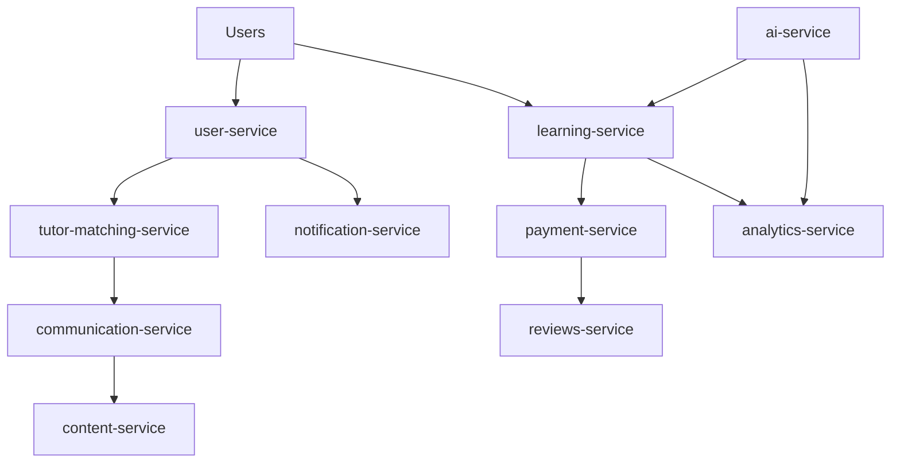

# Phase 0: Project Setup & Foundation
**Sprint 1 | Duration: 1 week**

## 🎯 Phase Objectives
Establish the foundational project structure, development environment, and database migration infrastructure required for all subsequent phases. This phase creates the scaffolding that enables efficient microservices development with proper database per service architecture.

## 📋 Phase Dependencies
- **Prerequisites**: None (starting point)
- **Outputs**: Complete development environment, project structure, migration infrastructure

## 🔧 Subphases

### 0.1 Initialize Project Structure
**Duration: 1 day | Priority: Critical**

#### 0.1.1 Create NestJS Monorepo Structure
**Detailed Tasks:**
- [ ] **Prerequisites Setup**
  ```bash
  # Install Node.js 18+ and pnpm
  node --version  # Should be 18+
  pnpm --version  # If not installed: npm install -g pnpm
  
  # Create .nvmrc for Node.js version consistency
  echo "18" > .nvmrc
  ```

- [ ] **Initialize NestJS Monorepo**
  ```bash
  # Install NestJS CLI globally with pnpm
  pnpm add -g @nestjs/cli
  
  # Create initial NestJS project with pnpm
  nest new edtech-platform-backend --package-manager pnpm
  cd edtech-platform-backend
  
  # Convert to monorepo structure
  nest generate app user-service
  nest generate app learning-service
  nest generate app tutor-matching-service
  nest generate app payment-service
  nest generate app reviews-service
  nest generate app communication-service
  nest generate app content-service
  nest generate app notification-service
  nest generate app analytics-service
  nest generate app ai-service
  ```

- [ ] **Create Shared Libraries**
  ```bash
  # Generate core shared libraries
  nest generate lib shared-types
  nest generate lib shared-utils
  nest generate lib shared-events
  nest generate lib shared-database
  nest generate lib shared-domain
  
  # Generate specialized shared libraries
  nest generate lib shared-security
  nest generate lib shared-communication
  nest generate lib shared-validation
  nest generate lib shared-notifications
  nest generate lib shared-analytics
  ```

- [ ] **Additional Directory Structure**
  ```bash
  mkdir -p cdk/{lib/{constructs,stacks},bin}
  mkdir -p docs/{api,architecture,deployment}
  mkdir -p scripts/{development,deployment,migration,seed}
  mkdir -p tests/{integration,e2e,performance}
  ```

- [ ] **Documentation Structure**
  ```bash
  mkdir -p docs/{api-specifications,architecture-decisions,deployment-guides,troubleshooting}
  ```

- [ ] **Architecture Pattern Implementation**
  - Review [Architectural Patterns Guide](../reference/architectural-patterns-guide.md)
  - Set up DDD + CQRS folder structure per service
  - Configure EventBridge + Saga pattern infrastructure
  - Establish local vs inter-service event handling patterns

## 🏗️ Improved Microservice Architecture

### Service Boundary Definitions

#### Core Services
1. **`user-service`** - Identity & Access Management
   - User authentication and authorization
   - Social login integration (Google, Facebook, Apple)
   - User profile management
   - Role-based access control
   - **Database**: PostgreSQL (User identity, roles, permissions)

2. **`learning-service`** (formerly courses-service)
   - Course creation and management
   - Lesson structure and content organization
   - Student enrollment and progress tracking
   - Learning path management
   - **Database**: PostgreSQL (Course metadata, enrollments, progress)

3. **`tutor-matching-service`** - Intelligent Matching
   - Tutor profile and expertise management
   - Student-tutor matching algorithms
   - Availability and scheduling
   - Skill graph and relationships
   - **Database**: Neo4j (Skill relationships) + DynamoDB (Profiles)

4. **`payment-service`** - Financial Operations
   - Dual payment models (per-lesson & full-course)
   - Stripe integration and commission handling (20%)
   - Financial reporting and analytics
   - Payout management for tutors
   - **Database**: PostgreSQL (Financial transactions, ACID compliance)

5. **`reviews-service`** - Trust & Quality
   - Centralized review system (tutors & courses)
   - Rating algorithms and aggregation
   - Content moderation and quality control
   - Review analytics and insights
   - **Database**: PostgreSQL (Review analytics, complex queries)

#### Communication & Content Services
6. **`communication-service`** (merged chat + video)
   - Real-time messaging and chat
   - Video call orchestration (Agora.io)
   - Screen sharing and collaboration tools
   - Session recording and playback
   - **Database**: DynamoDB (Messages, call metadata) + Redis (Real-time)

7. **`content-service`** - Media & File Management
   - File upload and storage (S3)
   - Content delivery and CDN management
   - Media processing and optimization
   - Content versioning and backup
   - **Database**: DynamoDB (Metadata) + S3 (Files)

#### Platform Services
8. **`notification-service`** - Unified Notifications
   - Push notifications (mobile & web)
   - Email and SMS notifications
   - In-app notification management
   - Notification preferences and delivery
   - **Database**: DynamoDB (Notification queue, preferences)

9. **`analytics-service`** - Business Intelligence
   - User behavior tracking and analysis
   - Business metrics and KPI monitoring
   - Real-time dashboards and reporting
   - Data warehouse integration
   - **Database**: DynamoDB (Event storage) + OpenSearch (Analytics)

10. **`ai-service`** - Future Enhancement (V2.0)
    - RAG-based learning assistant
    - Personalized learning recommendations
    - Intelligent content generation
    - Learning path optimization
    - **Database**: OpenSearch (Vector embeddings) + DynamoDB

### Enhanced Shared Libraries

#### Core Libraries
- **`@app/shared-types`** - Common TypeScript interfaces and types
- **`@app/shared-utils`** - Utility functions and helpers
- **`@app/shared-events`** - Event definitions and event bus abstractions
- **`@app/shared-database`** - Database connection and query utilities
- **`@app/shared-domain`** - Domain primitives and base classes

#### Specialized Libraries
- **`@app/shared-security`** - Authentication, authorization, encryption utilities
- **`@app/shared-communication`** - Real-time messaging patterns and WebSocket abstractions
- **`@app/shared-validation`** - Common validation rules and schemas
- **`@app/shared-notifications`** - Notification templates and delivery abstractions
- **`@app/shared-analytics`** - Event tracking and analytics utilities

### Architecture Improvements

#### 1. **Better Domain Boundaries**
- **Learning Service**: Focused on educational content and progress
- **Communication Service**: Unified real-time communication (chat + video)
- **Content Service**: Dedicated media and file management

#### 2. **Separation of Concerns**
- **Notification Service**: Centralized notification handling
- **Analytics Service**: Dedicated business intelligence
- **Content Service**: Extracted from learning service for better scalability

#### 3. **Technology Optimization**
- **Redis**: Added for real-time communication and caching
- **Enhanced Shared Libraries**: Better code reuse and consistency
- **Database per Service**: Maintained proper microservice boundaries

#### 4. **Scalability Considerations**
- **Communication Service**: Can scale independently for high-volume messaging
- **Content Service**: Optimized for media delivery and storage
- **Analytics Service**: Can handle large-scale data processing

### Service Interaction Patterns



This improved architecture provides:
- ✅ **Clear domain boundaries** with single responsibilities
- ✅ **Better scalability** through focused services
- ✅ **Improved maintainability** with shared libraries
- ✅ **Enhanced performance** with dedicated caching and communication layers
- ✅ **Future-ready** with analytics and AI integration points

#### 0.1.2 Initialize Git Repository
**Detailed Tasks:**
- [ ] **Git Configuration**
  ```bash
  git init
  git config user.name "Your Name"
  git config user.email "your.email@example.com"
  ```

- [ ] **Create .gitignore**
  ```gitignore
  # Dependencies
  node_modules/
  
  # pnpm
  .pnpm-store/
  .pnpm-debug.log*
  
  # Build outputs
  dist/
  build/
  
  # Environment files
  .env*
  !.env.example
  
  # AWS patterns
  cdk.out/
  *.pem
  .aws/
  
  # Database patterns
  *.db
  *.sqlite
  postgres-data/
  
  # IDE patterns
  .vscode/
  .idea/
  *.swp
  *.swo
  
  # LocalStack patterns
  localstack-data/
  .localstack/
  
  # Logs
  *.log
  npm-debug.log*
  yarn-debug.log*
  yarn-error.log*
  
  # OS
  .DS_Store
  Thumbs.db
  ```

- [ ] **Create pnpm-workspace.yaml**
  ```yaml
  packages:
    - 'apps/*'
    - 'libs/*'
    - 'cdk'
  ```

- [ ] **Git Hooks Setup**
  - Pre-commit hooks for linting and formatting
  - Pre-push hooks for running tests
  - Commit message validation

### 0.2 Setup Package Management
**Duration: 1 day | Priority: Critical**

#### 0.2.1 Root Package.json Configuration
**Detailed Tasks:**
- [ ] **Configure NestJS Monorepo Package.json**
  ```json
  {
    "name": "edtech-platform-backend",
    "version": "1.0.0",
    "private": true,
    "scripts": {
      "build": "nest build",
      "format": "prettier --write \"apps/**/*.ts\" \"libs/**/*.ts\"",
      "start": "nest start",
      "start:dev": "nest start --watch",
      "start:debug": "nest start --debug --watch",
      "start:prod": "node dist/apps/main/main",
      "lint": "eslint \"{src,apps,libs,test}/**/*.ts\" --fix",
      "test": "jest",
      "test:watch": "jest --watch",
      "test:cov": "jest --coverage",
      "test:debug": "node --inspect-brk -r tsconfig-paths/register -r ts-node/register node_modules/.bin/jest --runInBand",
      "test:e2e": "jest --config ./apps/user-service/test/jest-e2e.json",
      "migrate:all": "pnpm migrate:user && pnpm migrate:payment && pnpm migrate:reviews && pnpm migrate:learning",
      "migrate:user": "cd apps/user-service && pnpm typeorm:migration:run",
      "migrate:payment": "cd apps/payment-service && pnpm typeorm:migration:run",
      "migrate:reviews": "cd apps/reviews-service && pnpm typeorm:migration:run",
      "migrate:learning": "cd apps/learning-service && pnpm typeorm:migration:run"
    }
  }
  ```

- [ ] **Install Additional Dependencies**
  - `concurrently` - Run multiple scripts
  - `husky` - Git hooks
  - `lint-staged` - Staged file linting
  - `@nestjs/typeorm` - TypeORM integration
  - `@nestjs/cqrs` - CQRS pattern support

#### 0.2.2 TypeScript Configuration
**Detailed Tasks:**
- [ ] **Root tsconfig.json (NestJS Monorepo)**
  ```json
  {
    "compilerOptions": {
      "module": "commonjs",
      "declaration": true,
      "removeComments": true,
      "emitDecoratorMetadata": true,
      "experimentalDecorators": true,
      "allowSyntheticDefaultImports": true,
      "target": "ES2021",
      "sourceMap": true,
      "outDir": "./dist",
      "baseUrl": "./",
      "incremental": true,
      "skipLibCheck": true,
      "strictNullChecks": false,
      "noImplicitAny": false,
      "strictBindCallApply": false,
      "forceConsistentCasingInFileNames": false,
      "noFallthroughCasesInSwitch": false,
      "paths": {
        "@app/shared-types": ["libs/shared-types/src"],
        "@app/shared-types/*": ["libs/shared-types/src/*"],
        "@app/shared-utils": ["libs/shared-utils/src"],
        "@app/shared-utils/*": ["libs/shared-utils/src/*"],
        "@app/shared-events": ["libs/shared-events/src"],
        "@app/shared-events/*": ["libs/shared-events/src/*"],
        "@app/shared-database": ["libs/shared-database/src"],
        "@app/shared-database/*": ["libs/shared-database/src/*"],
        "@app/shared-domain": ["libs/shared-domain/src"],
        "@app/shared-domain/*": ["libs/shared-domain/src/*"],
        "@app/shared-security": ["libs/shared-security/src"],
        "@app/shared-security/*": ["libs/shared-security/src/*"],
        "@app/shared-communication": ["libs/shared-communication/src"],
        "@app/shared-communication/*": ["libs/shared-communication/src/*"],
        "@app/shared-validation": ["libs/shared-validation/src"],
        "@app/shared-validation/*": ["libs/shared-validation/src/*"],
        "@app/shared-notifications": ["libs/shared-notifications/src"],
        "@app/shared-notifications/*": ["libs/shared-notifications/src/*"],
        "@app/shared-analytics": ["libs/shared-analytics/src"],
        "@app/shared-analytics/*": ["libs/shared-analytics/src/*"]
      }
    }
  }
  ```

- [ ] **Service-Specific tsconfig.json**
  - Extend root configuration
  - Service-specific path mappings
  - Build output configurations

### 0.3 Code Quality & Standards
**Duration: 1 day | Priority: High**

#### 0.3.1 ESLint Configuration
**Detailed Tasks:**
- [ ] **Root .eslintrc.js**
  ```javascript
  module.exports = {
    root: true,
    parser: '@typescript-eslint/parser',
    plugins: ['@typescript-eslint'],
    extends: [
      'eslint:recommended',
      '@typescript-eslint/recommended',
      'prettier'
    ],
    rules: {
      '@typescript-eslint/interface-name-prefix': 'off',
      '@typescript-eslint/explicit-function-return-type': 'off',
      '@typescript-eslint/explicit-module-boundary-types': 'off',
      '@typescript-eslint/no-explicit-any': 'error'
    }
  };
  ```

- [ ] **Service-Specific ESLint Rules**
  - Domain layer restrictions (no external dependencies)
  - Application layer validation
  - Infrastructure layer guidelines

#### 0.3.2 Prettier Configuration
**Detailed Tasks:**
- [ ] **Create .prettierrc**
  ```json
  {
    "semi": true,
    "trailingComma": "es5",
    "singleQuote": true,
    "printWidth": 100,
    "tabWidth": 2,
    "useTabs": false
  }
  ```

- [ ] **VSCode Settings**
  ```json
  {
    "editor.formatOnSave": true,
    "editor.codeActionsOnSave": {
      "source.fixAll.eslint": true
    }
  }
  ```

### 0.4 Docker & LocalStack Setup
**Duration: 2 days | Priority: Critical**

#### 0.4.1 Docker Compose Configuration
**Detailed Tasks:**
- [ ] **Create docker-compose.yml**
  ```yaml
  version: '3.8'
  services:
    # LocalStack for AWS services
    localstack:
      container_name: edtech-localstack
      image: localstack/localstack:latest
      ports:
        - "4566:4566"
      environment:
        - SERVICES=dynamodb,s3,lambda,eventbridge,cognito-idp,opensearch,rds
        - DEBUG=1
        - DATA_DIR=/tmp/localstack/data
      volumes:
        - "./localstack-data:/tmp/localstack"
        - "/var/run/docker.sock:/var/run/docker.sock"

    # PostgreSQL for User Service
    postgres-user:
      container_name: edtech-postgres-user
      image: postgres:15
      environment:
        POSTGRES_DB: user_service
        POSTGRES_USER: user_service
        POSTGRES_PASSWORD: user_password
      ports:
        - "5432:5432"
      volumes:
        - postgres-user-data:/var/lib/postgresql/data

    # PostgreSQL for Payment Service
    postgres-payment:
      container_name: edtech-postgres-payment
      image: postgres:15
      environment:
        POSTGRES_DB: payment_service
        POSTGRES_USER: payment_service
        POSTGRES_PASSWORD: payment_password
      ports:
        - "5433:5432"
      volumes:
        - postgres-payment-data:/var/lib/postgresql/data

    # PostgreSQL for Reviews Service
    postgres-reviews:
      container_name: edtech-postgres-reviews
      image: postgres:15
      environment:
        POSTGRES_DB: reviews_service
        POSTGRES_USER: reviews_service
        POSTGRES_PASSWORD: reviews_password
      ports:
        - "5434:5432"
      volumes:
        - postgres-reviews-data:/var/lib/postgresql/data

    # PostgreSQL for Learning Service
    postgres-learning:
      container_name: edtech-postgres-learning
      image: postgres:15
      environment:
        POSTGRES_DB: learning_service
        POSTGRES_USER: learning_service
        POSTGRES_PASSWORD: learning_password
      ports:
        - "5435:5432"
      volumes:
        - postgres-learning-data:/var/lib/postgresql/data

    # Redis for Communication Service and Caching
    redis:
      container_name: edtech-redis
      image: redis:7-alpine
      ports:
        - "6379:6379"
      volumes:
        - redis-data:/data
      command: redis-server --appendonly yes

    # Neo4j for Tutor Matching Service
    neo4j:
      container_name: edtech-neo4j
      image: neo4j:5.11
      environment:
        NEO4J_AUTH: neo4j/tutormatching
        NEO4J_PLUGINS: '["apoc"]'
      ports:
        - "7474:7474"
        - "7687:7687"
      volumes:
        - neo4j-data:/data

  volumes:
    postgres-user-data:
    postgres-payment-data:
    postgres-reviews-data:
    postgres-learning-data:
    redis-data:
    neo4j-data:
  ```

#### 0.4.2 Service Dockerfiles
**Detailed Tasks:**
- [ ] **Base Dockerfile Template**
  ```dockerfile
  FROM node:18-alpine
  
  # Install pnpm globally
  RUN npm install -g pnpm
  
  WORKDIR /app
  
  # Copy package files
  COPY package.json pnpm-lock.yaml ./
  COPY pnpm-workspace.yaml ./
  COPY tsconfig*.json ./
  
  # Install dependencies
  RUN pnpm install --frozen-lockfile --prod
  
  # Copy source code
  COPY src/ ./src/
  
  # Build application
  RUN pnpm build
  
  # Expose port
  EXPOSE 3000
  
  # Health check
  HEALTHCHECK --interval=30s --timeout=3s --start-period=5s --retries=3 \
    CMD curl -f http://localhost:3000/health || exit 1
  
  # Start application
  CMD ["pnpm", "start:prod"]
  ```

- [ ] **Service-Specific Dockerfiles**
  - Customize for each microservice
  - Include service-specific dependencies
  - Configure environment variables

#### 0.4.3 LocalStack Configuration
**Detailed Tasks:**
- [ ] **LocalStack Initialization Script**
  ```bash
  #!/bin/bash
  # scripts/init-localstack.sh
  
  echo "Waiting for LocalStack to be ready..."
  while ! curl -s http://localhost:4566/_localstack/health > /dev/null; do
    sleep 2
  done
  
  echo "Creating DynamoDB tables..."
  aws --endpoint-url=http://localhost:4566 dynamodb create-table \
    --table-name Courses \
    --attribute-definitions AttributeName=courseId,AttributeType=S \
    --key-schema AttributeName=courseId,KeyType=HASH \
    --billing-mode PAY_PER_REQUEST
  
  # Additional table creation scripts...
  
  echo "LocalStack initialization complete!"
  ```

- [ ] **AWS CLI Configuration**
  ```bash
  # ~/.aws/config
  [profile localstack]
  region = us-east-1
  output = json
  endpoint_url = http://localhost:4566
  ```

### 0.5 Database Migration & Seeding Infrastructure
**Duration: 2 days | Priority: Critical**

#### 0.5.1 PostgreSQL Migration Setup
**Detailed Tasks:**
- [ ] **TypeORM Configuration per Service**
  ```typescript
  // apps/user-service/src/database/ormconfig.ts
  import { DataSource } from 'typeorm';
  
  export const UserServiceDataSource = new DataSource({
    type: 'postgres',
    host: process.env.POSTGRES_HOST || 'localhost',
    port: parseInt(process.env.POSTGRES_PORT || '5432'),
    username: process.env.POSTGRES_USER || 'user_service',
    password: process.env.POSTGRES_PASSWORD || 'user_password',
    database: process.env.POSTGRES_DB || 'user_service',
    entities: ['src/domain/entities/*.entity.ts'],
    migrations: ['src/migrations/*.ts'],
    synchronize: false,
    logging: process.env.NODE_ENV === 'development',
  });
  ```

- [ ] **Migration Scripts Structure**
  ```bash
  apps/user-service/src/migrations/
  ├── 001-create-users-table.ts
  ├── 002-create-roles-table.ts
  ├── 003-create-user-roles-table.ts
  └── seeds/
      ├── admin-user.seed.ts
      ├── default-roles.seed.ts
      └── test-users.seed.ts
  ```

#### 0.5.2 DynamoDB Schema Management
**Detailed Tasks:**
- [ ] **CDK Table Definitions**
  ```typescript
  // cdk/lib/constructs/dynamodb-table.construct.ts
  import { Table, AttributeType, BillingMode } from 'aws-cdk-lib/aws-dynamodb';
  
  export class DynamoDbTableConstruct extends Construct {
    public readonly table: Table;
  
    constructor(scope: Construct, id: string, props: DynamoDbTableProps) {
      super(scope, id);
  
      this.table = new Table(this, 'Table', {
        tableName: props.tableName,
        partitionKey: { name: props.partitionKey, type: AttributeType.STRING },
        sortKey: props.sortKey ? { name: props.sortKey, type: AttributeType.STRING } : undefined,
        billingMode: BillingMode.PAY_PER_REQUEST,
        pointInTimeRecovery: true,
        removalPolicy: RemovalPolicy.DESTROY, // For development
      });
    }
  }
  ```

- [ ] **Schema Versioning Strategy**
  - Document structure versioning
  - Data migration Lambda functions
  - Backward compatibility patterns

#### 0.5.3 Neo4j Migration System
**Detailed Tasks:**
- [ ] **Cypher Migration Framework**
  ```typescript
  // apps/tutor-matching-service/src/database/neo4j-migrator.ts
  export class Neo4jMigrator {
    async runMigrations(): Promise<void> {
      const migrationFiles = await this.getMigrationFiles();
      
      for (const file of migrationFiles) {
        if (!await this.isMigrationExecuted(file)) {
          await this.executeMigration(file);
          await this.recordMigration(file);
        }
      }
    }
  }
  ```

- [ ] **Migration Scripts Structure**
  ```cypher
  // apps/tutor-matching-service/migrations/001-create-constraints.cypher
  CREATE CONSTRAINT tutor_id_unique IF NOT EXISTS
  FOR (t:Tutor) REQUIRE t.tutorId IS UNIQUE;
  
  CREATE CONSTRAINT skill_name_unique IF NOT EXISTS
  FOR (s:Skill) REQUIRE s.name IS UNIQUE;
  ```

### 0.6 Development Scripts & Automation
**Duration: 1 day | Priority: High**

#### 0.6.1 Development Environment Scripts
**Detailed Tasks:**
- [ ] **Master Setup Script**
  ```bash
  #!/bin/bash
  # scripts/dev-setup.sh
  
  echo "🚀 Setting up EdTech Platform development environment..."
  
  # Install dependencies
  echo "Installing dependencies..."
  pnpm install
  
  # Start databases
  echo "Starting database containers..."
  docker-compose up -d postgres-user postgres-payment postgres-reviews neo4j
  
  # Wait for databases
  echo "Waiting for databases to be ready..."
  ./scripts/wait-for-databases.sh
  
  # Initialize LocalStack
  echo "Starting LocalStack..."
  docker-compose up -d localstack
  ./scripts/init-localstack.sh
  
  # Run migrations
  echo "Running database migrations..."
  pnpm migrate:all
  
  # Seed databases
  echo "Seeding databases..."
  pnpm seed:all
  
  echo "✅ Development environment ready!"
  echo "📝 Next steps:"
  echo "  - Run 'pnpm dev' to start all services"
  echo "  - Visit http://localhost:4566 for LocalStack"
  echo "  - Visit http://localhost:7474 for Neo4j Browser"
  ```

- [ ] **Database Wait Script**
  ```bash
  #!/bin/bash
  # scripts/wait-for-databases.sh
  
  wait_for_postgres() {
    local port=$1
    local service=$2
    
    echo "Waiting for PostgreSQL ($service) on port $port..."
    while ! nc -z localhost $port; do
      sleep 1
    done
    echo "PostgreSQL ($service) is ready!"
  }
  
  wait_for_postgres 5432 "user-service"
  wait_for_postgres 5433 "payment-service"
  wait_for_postgres 5434 "reviews-service"
  wait_for_postgres 5435 "learning-service"
  
  echo "Waiting for Neo4j..."
  while ! nc -z localhost 7687; do
    sleep 1
  done
  echo "Neo4j is ready!"
  ```

#### 0.6.2 Migration Runner Scripts
**Detailed Tasks:**
- [ ] **Service-Specific Migration Runners**
  ```bash
  # apps/user-service/scripts/migrate.sh
  #!/bin/bash
  
  echo "Running User Service migrations..."
  pnpm typeorm migration:run -- -d src/database/ormconfig.ts
  
  if [ "$1" = "--seed" ]; then
    echo "Running User Service seeds..."
    pnpm seed:run
  fi
  ```

- [ ] **Master Migration Script**
  ```bash
  #!/bin/bash
  # scripts/migrate-all.sh
  
  services=("user-service" "payment-service" "reviews-service" "tutor-matching-service")
  
  for service in "${services[@]}"; do
    echo "Migrating $service..."
    cd "apps/$service" && npm run migrate
    cd "../.."
  done
  
  echo "Creating DynamoDB tables..."
  npm run cdk:deploy --local
  ```

### 0.7 Environment Configuration
**Duration: 1 day | Priority: High**

#### 0.7.1 Environment Variables Setup
**Detailed Tasks:**
- [ ] **Root .env.example**
  ```bash
  # Database Configuration
  POSTGRES_USER_HOST=localhost
  POSTGRES_USER_PORT=5432
  POSTGRES_USER_DB=user_service
  POSTGRES_USER_USER=user_service
  POSTGRES_USER_PASSWORD=user_password
  
  POSTGRES_PAYMENT_HOST=localhost
  POSTGRES_PAYMENT_PORT=5433
  POSTGRES_PAYMENT_DB=payment_service
  POSTGRES_PAYMENT_USER=payment_service
  POSTGRES_PAYMENT_PASSWORD=payment_password
  
  POSTGRES_REVIEWS_HOST=localhost
  POSTGRES_REVIEWS_PORT=5434
  POSTGRES_REVIEWS_DB=reviews_service
  POSTGRES_REVIEWS_USER=reviews_service
  POSTGRES_REVIEWS_PASSWORD=reviews_password
  
  # Neo4j Configuration
  NEO4J_URI=bolt://localhost:7687
  NEO4J_USER=neo4j
  NEO4J_PASSWORD=tutormatching
  
  # LocalStack Configuration
  LOCALSTACK_ENDPOINT=http://localhost:4566
  AWS_REGION=us-east-1
  AWS_ACCESS_KEY_ID=test
  AWS_SECRET_ACCESS_KEY=test
  
  # Social Authentication
  GOOGLE_CLIENT_ID=your_google_client_id
  GOOGLE_CLIENT_SECRET=your_google_client_secret
  FACEBOOK_APP_ID=your_facebook_app_id
  FACEBOOK_APP_SECRET=your_facebook_app_secret
  APPLE_CLIENT_ID=your_apple_client_id
  APPLE_PRIVATE_KEY_PATH=path_to_apple_private_key
  
  # Stripe Configuration
  STRIPE_SECRET_KEY=sk_test_your_stripe_secret_key
  STRIPE_WEBHOOK_SECRET=whsec_your_webhook_secret
  
  # Application Settings
  NODE_ENV=development
  LOG_LEVEL=debug
  API_PORT=3000
  ```

- [ ] **Service-Specific Environment Files**
  - Each service has its own .env.example
  - Service-specific configurations
  - Database connection strings
  - External service credentials

#### 0.7.2 Configuration Management
**Detailed Tasks:**
- [ ] **Configuration Validation**
  ```typescript
  // shared/config/config.validator.ts
  import { IsString, IsNumber, IsOptional, validateOrReject } from 'class-validator';
  
  export class DatabaseConfig {
    @IsString()
    host: string;
  
    @IsNumber()
    port: number;
  
    @IsString()
    database: string;
  
    @IsString()
    username: string;
  
    @IsString()
    password: string;
  }
  
  export async function validateConfig<T>(config: T): Promise<T> {
    await validateOrReject(config);
    return config;
  }
  ```

- [ ] **Configuration Loading**
  ```typescript
  // shared/config/config.loader.ts
  import { config } from 'dotenv';
  import { DatabaseConfig, validateConfig } from './config.validator';
  
  export class ConfigLoader {
    static async loadDatabaseConfig(service: string): Promise<DatabaseConfig> {
      config();
      
      const dbConfig = new DatabaseConfig();
      dbConfig.host = process.env[`POSTGRES_${service.toUpperCase()}_HOST`] || 'localhost';
      dbConfig.port = parseInt(process.env[`POSTGRES_${service.toUpperCase()}_PORT`] || '5432');
      dbConfig.database = process.env[`POSTGRES_${service.toUpperCase()}_DB`] || service;
      dbConfig.username = process.env[`POSTGRES_${service.toUpperCase()}_USER`] || service;
      dbConfig.password = process.env[`POSTGRES_${service.toUpperCase()}_PASSWORD`] || 'password';
      
      return validateConfig(dbConfig);
    }
  }
  ```

## ✅ Success Criteria

### Technical Acceptance Criteria
- [ ] Complete monorepo structure with all services scaffolded
- [ ] Docker Compose environment starts all databases successfully
- [ ] LocalStack initializes with all required AWS services
- [ ] All database migrations run successfully
- [ ] TypeScript compilation works across all services
- [ ] ESLint and Prettier run without errors
- [ ] Git hooks are functional and enforce code quality
- [ ] Environment configuration is validated and loaded correctly

### Documentation Deliverables
- [ ] README.md with setup instructions
- [ ] CONTRIBUTING.md with development guidelines
- [ ] API documentation structure in place
- [ ] Architecture decision records (ADRs) template
- [ ] Database schema documentation structure

### Operational Readiness
- [ ] Development environment can be set up with single command
- [ ] Database reset and reseed capabilities work
- [ ] Service health checks are implemented
- [ ] Logging framework is configured across all services
- [ ] Error handling patterns are established

## 🚨 Risk Mitigation

### Technical Risks
- **Docker Resource Usage**: Monitor memory and CPU usage during development
- **Database Port Conflicts**: Use different ports for each PostgreSQL instance
- **LocalStack Limitations**: Identify AWS service limitations early
- **Migration Complexity**: Start with simple migrations, build complexity gradually

### Development Risks
- **Environment Setup Complexity**: Automate everything, document edge cases
- **Configuration Management**: Validate all configurations, provide clear error messages
- **Developer Onboarding**: Create comprehensive setup guides and troubleshooting docs

## 📊 Key Performance Indicators (KPIs)

### Setup Efficiency
- **Environment Setup Time**: < 10 minutes for complete setup
- **Database Migration Time**: < 5 minutes for all services
- **Build Time**: < 2 minutes for TypeScript compilation
- **Test Execution Time**: < 30 seconds for lint/format checks

### Development Experience
- **Hot Reload Time**: < 3 seconds for code changes
- **Database Reset Time**: < 1 minute for complete reset
- **Container Startup Time**: < 30 seconds for all services

## 📅 Phase Timeline

| Subphase | Duration | Dependencies | Deliverables |
|----------|----------|--------------|--------------|
| 0.1 Project Structure | 1 day | - | Monorepo structure, Git setup |
| 0.2 Package Management | 1 day | 0.1 | TypeScript config, dependencies |
| 0.3 Code Quality | 1 day | 0.2 | ESLint, Prettier, Git hooks |
| 0.4 Docker & LocalStack | 2 days | 0.3 | Container environment |
| 0.5 Database Infrastructure | 2 days | 0.4 | Migration systems |
| 0.6 Development Scripts | 1 day | 0.5 | Automation scripts |
| 0.7 Environment Config | 1 day | 0.6 | Configuration management |

**Total Duration**: 7 days  
**Buffer**: +2 days for integration testing and documentation

---

**Next Phase**: [Phase 1: Core Infrastructure & User Service](phase-1-user-service.md) 