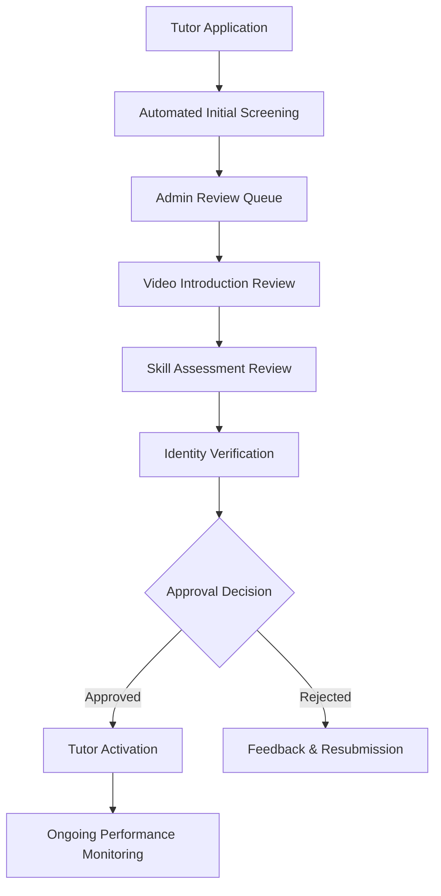
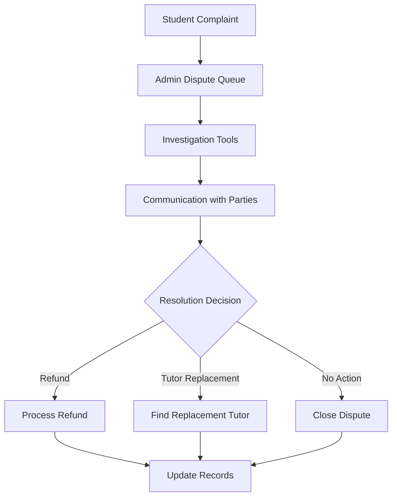

# Admin Panel Implementation Strategy

## Executive Summary

Based on comprehensive research of successful EdTech platforms (especially Preply) and marketplace moderation systems, an **admin panel is critical for MVP success**. This document outlines why manual workflow management is essential and how we've integrated it into our implementation plan.

## Research Findings

### Industry Standards for EdTech Admin Panels

From analyzing successful platforms, we identified these critical admin functions:

1. **User Management**: Profile editing, role management, account status control
2. **Quality Assurance**: Manual tutor verification, content moderation, performance monitoring  
3. **Financial Operations**: Payment disputes, refunds, commission management
4. **Support Management**: Ticket systems, direct user communication, escalation workflows
5. **Analytics & Reporting**: Business intelligence, operational metrics, trend analysis
6. **System Configuration**: Platform settings, feature flags, policy management

### Preply's Manual Quality Control Approach

Preply's success heavily relies on human oversight:
- **5-day manual review** for tutor applications
- **Human verification** of video introductions  
- **Customer support** for payment disputes and tutor replacements
- **Quality assurance** through ongoing performance monitoring
- **Content moderation** for courses and user-generated content

## Why Admin Panel is Critical for MVP

### **1. Quality Control Cannot Be Fully Automated**

```
Manual Processes That Require Human Judgment:
├── Tutor Application Review
│   ├── Video introduction assessment
│   ├── Skill demonstration evaluation  
│   └── Cultural fit and teaching ability
├── Content Moderation
│   ├── Course quality assessment
│   ├── Inappropriate content detection
│   └── Educational value verification
└── Dispute Resolution
    ├── Payment disputes
    ├── Quality complaints
    └── Policy violations
```

### **2. Platform Trust and Safety**

- **Trust Building**: Manual quality control builds user confidence
- **Brand Protection**: Prevents low-quality tutors from damaging platform reputation
- **Legal Compliance**: Content moderation ensures regulatory compliance
- **Safety Assurance**: Human oversight prevents harassment and inappropriate behavior

### **3. Business Operations**

- **Customer Support**: Support team needs tools to resolve user issues
- **Financial Management**: Manual intervention required for complex payment scenarios
- **Business Intelligence**: Analytics dashboard essential for data-driven decisions
- **Policy Enforcement**: Consistent application of platform rules and guidelines

## Implementation Strategy

### Phase 6: Admin Panel & Moderation System

**Timeline**: Sprint 12-14 (5 weeks)  
**Position**: After core services, before API integration

#### Critical Admin Features

| **Category** | **Features** | **Business Impact** |
|--------------|-------------|-------------------|
| **Tutor Management** | Application review, video verification, skill assessment | Quality assurance, platform trust |
| **User Support** | Profile management, account issues, dispute resolution | Customer satisfaction, retention |
| **Financial Operations** | Payment disputes, refunds, commission management | Revenue protection, tutor satisfaction |
| **Content Moderation** | Course review, inappropriate content flagging | Platform safety, compliance |
| **Analytics** | Performance metrics, business intelligence | Data-driven decisions, optimization |

### Technical Architecture

```typescript
// Admin Service Integration
interface AdminDashboard {
  services: {
    userService: 'user-management-tools';
    tutorService: 'verification-and-quality-tools';
    paymentService: 'financial-management-tools';
    reviewService: 'content-moderation-tools';
    analyticsService: 'business-intelligence-dashboard';
  };
  
  roleBasedAccess: {
    superAdmin: 'full-platform-control';
    moderator: 'content-and-user-management';
    supportAgent: 'user-support-and-communication';
    financialAdmin: 'payment-and-commission-management';
  };
}
```

### Integration with Preply Insights

| **Preply Pattern** | **Our Implementation** | **Competitive Advantage** |
|-------------------|----------------------|--------------------------|
| 100% trial commission | 50% trial commission | Better tutor economics |
| 33% → 18% commission tiers | 25% → 15% commission tiers | Superior tutor retention |
| Manual tutor verification | Enhanced verification + skill tests | Higher quality assurance |
| Human content review | AI + human hybrid moderation | More efficient and accurate |

## Operational Workflows

### Tutor Verification Workflow



### Payment Dispute Resolution



## Success Metrics

### Operational Efficiency
- **Tutor verification time**: < 48 hours (vs industry standard 5-7 days)
- **Support ticket resolution**: < 4 hours average
- **Payment dispute resolution**: < 24 hours
- **Content moderation accuracy**: > 95%

### Quality Assurance
- **Tutor approval rate**: 60-70% (maintaining quality standards)
- **Student satisfaction**: > 4.0/5.0 for verified tutors
- **Platform trust score**: Measurable improvement in user confidence
- **Content quality**: < 5% inappropriate content reaching platform

### Business Impact
- **Operational cost reduction**: 40% through efficient admin tools
- **Platform reputation**: Positive user feedback on quality
- **Tutor retention**: Higher retention due to fair policies
- **User growth**: Word-of-mouth growth from quality experience

## Risk Mitigation

### Technical Risks
- **Performance**: Efficient querying and caching for large datasets
- **Integration**: Reliable API communication with error handling
- **Security**: Comprehensive admin access controls and audit logging
- **Scalability**: Admin tools must handle growing platform traffic

### Operational Risks  
- **Training**: Comprehensive admin team training on all tools
- **Process Documentation**: Detailed procedures for all workflows
- **Escalation**: Clear escalation paths for complex issues
- **Backup Procedures**: Manual fallback if systems fail

## Competitive Advantage

### Superior Quality Control
- **Enhanced verification**: Technical skill assessments beyond general teaching
- **Hybrid moderation**: AI screening + human review for efficiency
- **Performance tracking**: Ongoing quality monitoring and improvement

### Better Economics
- **Fairer commission structure**: More tutor-friendly than Preply
- **Transparent processes**: Clear policies and fair dispute resolution
- **Performance incentives**: Rewards for high-quality tutors

### Operational Excellence
- **Faster resolution**: More efficient admin tools than competitors
- **Better analytics**: Data-driven decision making capabilities
- **Proactive management**: Preventive quality measures vs reactive fixes

## Implementation Checklist

### Week 1-2: Foundation
- [ ] Admin service infrastructure setup
- [ ] Role-based authentication system
- [ ] Basic user management dashboard
- [ ] Integration with existing services

### Week 3-4: Core Features
- [ ] Tutor verification workflow
- [ ] Payment dispute management
- [ ] Content moderation tools
- [ ] Support ticket system

### Week 5: Analytics & Training
- [ ] Analytics dashboard
- [ ] Reporting tools
- [ ] Admin team training
- [ ] Process documentation

## Conclusion

The admin panel is not just a "nice-to-have" for post-MVP - it's **essential for MVP success**. Manual quality control is what separates successful EdTech platforms from failed ones. By implementing comprehensive admin tools early, we ensure:

1. **Platform Quality**: Human oversight maintains high standards
2. **User Trust**: Quality control builds confidence and reputation  
3. **Operational Efficiency**: Support teams can resolve issues quickly
4. **Business Intelligence**: Data-driven decisions for platform optimization
5. **Competitive Advantage**: Superior quality control and user experience

Our admin panel strategy positions us to compete effectively with established platforms like Preply while providing superior tutor economics and quality assurance. 