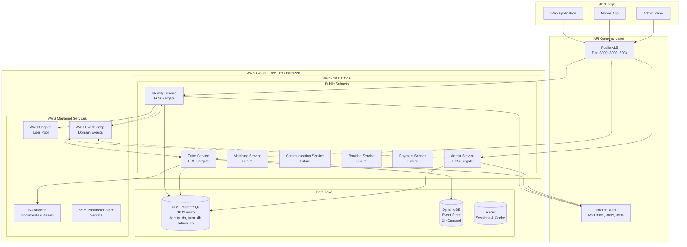
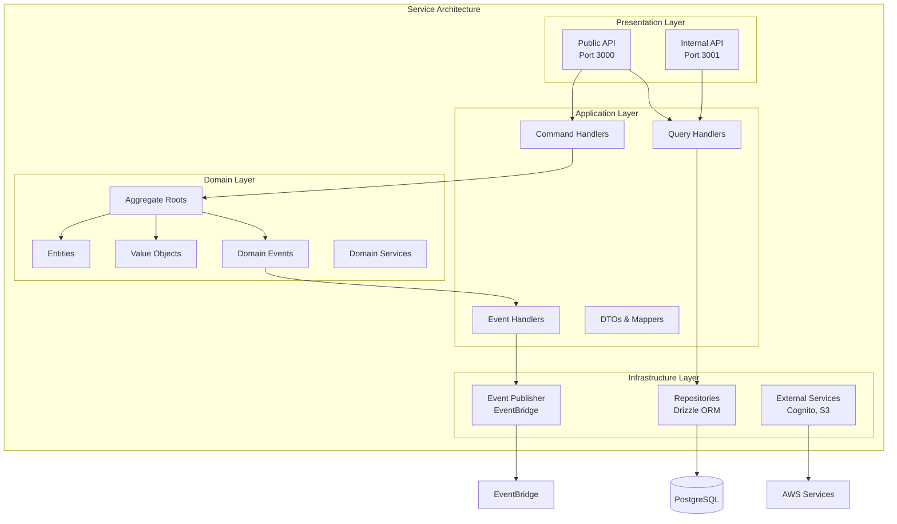
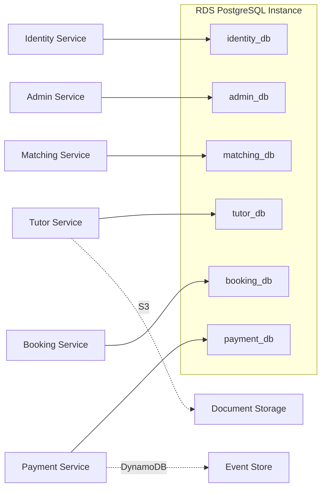
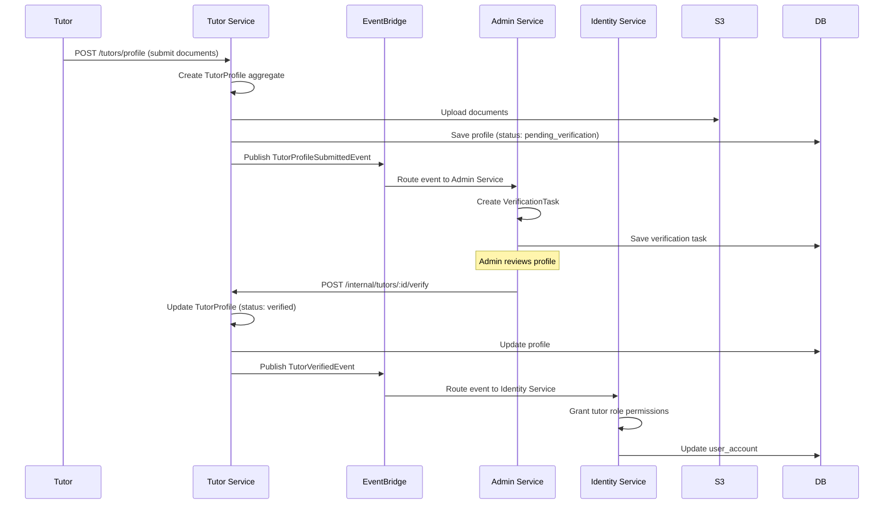
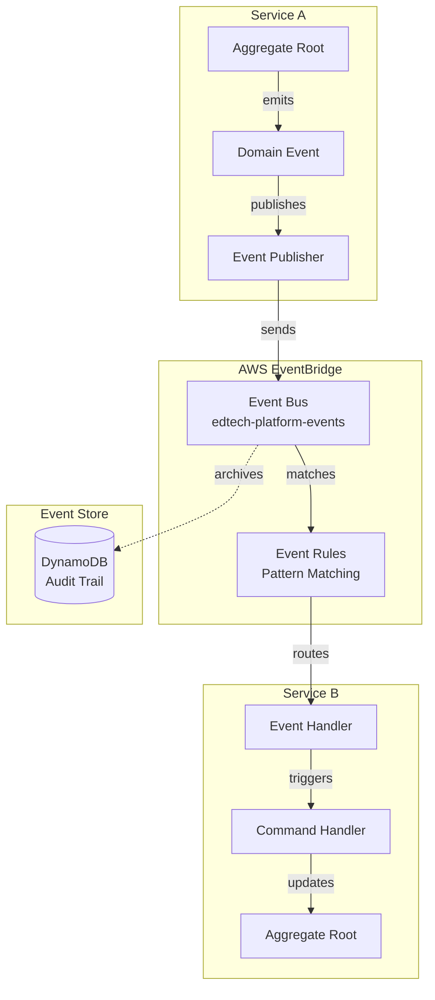
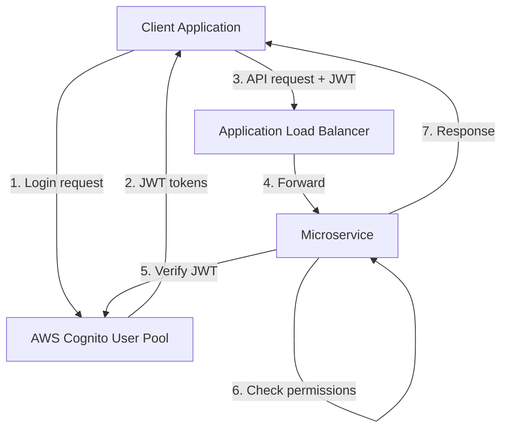
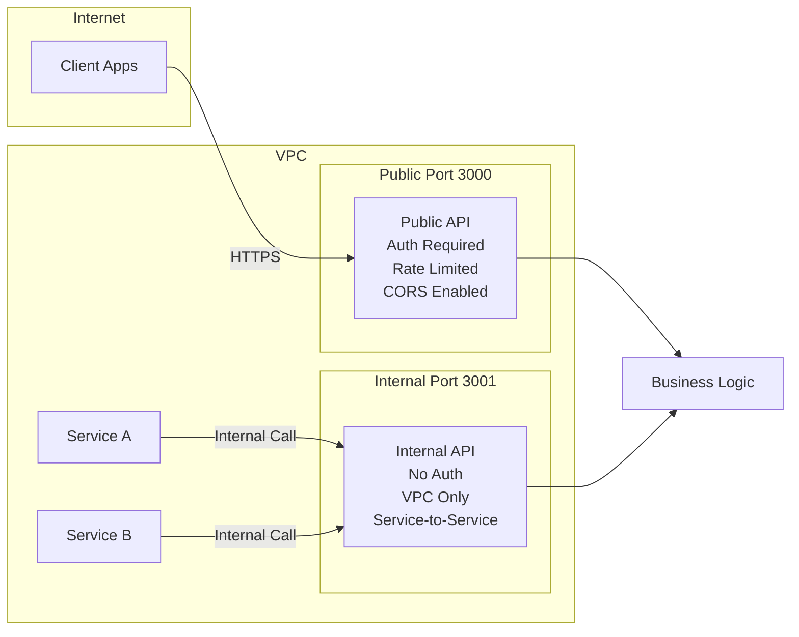
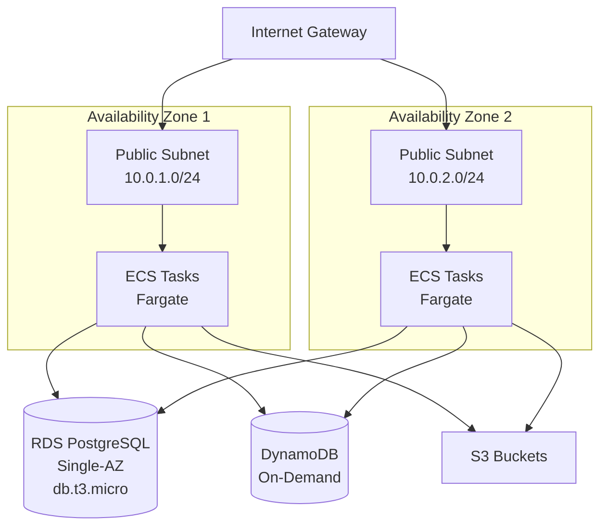
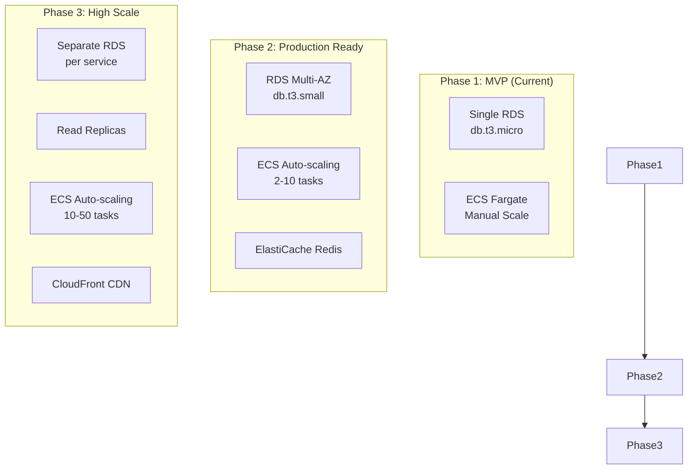

# EdTech Platform - System Architecture

**Last Updated:** November 2025
**Platform Type:** 1-to-1 Tutor-Student Matching (Mathematics & Programming Education)
**Business Model:** 20% commission on completed lessons

---

## Table of Contents

1. [High-Level Architecture](#high-level-architecture)
2. [Bounded Contexts](#bounded-contexts)
3. [Service Architecture](#service-architecture)
4. [Data Architecture](#data-architecture)
5. [Event-Driven Communication](#event-driven-communication)
6. [Authentication & Authorization](#authentication--authorization)
7. [API Gateway Patterns](#api-gateway-patterns)
8. [Infrastructure Architecture](#infrastructure-architecture)
9. [Scalability Strategy](#scalability-strategy)
10. [Security Architecture](#security-architecture)

---

## High-Level Architecture



---

## Bounded Contexts

Based on Domain-Driven Design principles, we've identified the following bounded contexts (microservices):

### Implemented Services

| Service | Status | Domain Responsibility | Database | Key Entities |
|---------|--------|----------------------|----------|--------------|
| **Identity Service** | ✅ Implemented | User registration, authentication, email verification, COPPA compliance | PostgreSQL (identity_db) | UserAccount, StudentProfile, Session |
| **Tutor Service** | ✅ Implemented | Tutor onboarding, profile management, document verification, qualification tracking | PostgreSQL (tutor_db) | TutorProfile, VerificationDocument, Subject, Expertise |
| **Admin Service** | ✅ Implemented | Platform administration, tutor verification, user management, analytics | PostgreSQL (admin_db) | AdminUser, VerificationDecision, AuditLog |

### Future Services

| Service | Status | Domain Responsibility | Database | Technology |
|---------|--------|----------------------|----------|------------|
| **Matching Service** | 🔮 Planned | Smart tutor-student matching, search, connection requests | PostgreSQL + Algolia | Search algorithms |
| **Communication Service** | 🔮 Planned | Real-time chat, video lessons, file sharing | DynamoDB + Agora.io | WebSocket, Video SDK |
| **Booking Service** | 🔮 Planned | Lesson scheduling, availability management, calendar sync | PostgreSQL | Scheduling logic |
| **Payment Service** | 🔮 Planned | Payment processing, commission calculation, tutor payouts | PostgreSQL + Event Store | Stripe Connect |

---

## Service Architecture

Each microservice follows a **Clean Architecture** pattern with **Domain-Driven Design** principles:



### Layer Responsibilities

**Presentation Layer:**
- Public API: Client-facing REST endpoints (authenticated, rate-limited)
- Internal API: Service-to-service communication (VPC-only, no auth)

**Application Layer:**
- Orchestrates use cases via CQRS pattern
- Command handlers mutate state
- Query handlers read data
- Event handlers react to domain events

**Domain Layer:**
- Pure business logic (no infrastructure dependencies)
- Aggregates enforce consistency boundaries
- Value objects ensure data validity
- Domain events communicate state changes

**Infrastructure Layer:**
- Persistence via Drizzle ORM
- Event publishing via AWS EventBridge
- External integrations (Cognito, S3, SSM)

---

## Data Architecture

### Database Strategy



**Key Principles:**
- **Database-per-service:** Each service has its own PostgreSQL database on shared RDS instance
- **No cross-database queries:** Services communicate via internal APIs or events
- **Single RDS instance:** Cost optimization for development/demo ($15/month after free tier vs $45/month for 3 instances)
- **DynamoDB for events:** Event sourcing for payment service and audit logs

### Data Flow Example: Tutor Verification



---

## Event-Driven Communication

### Event Architecture



### Event Examples

**Domain Events Published:**

| Event | Source Service | Consumer Services | Purpose |
|-------|---------------|-------------------|---------|
| `UserCreatedEvent` | Identity | Tutor, Matching | Create user profiles in other contexts |
| `EmailVerifiedEvent` | Identity | Admin | Track user verification status |
| `TutorProfileSubmittedEvent` | Tutor | Admin | Trigger verification workflow |
| `TutorVerifiedEvent` | Tutor | Identity, Matching | Grant permissions, enable matching |
| `DocumentUploadedEvent` | Tutor | Admin | Notify admins of new documents |
| `VerificationDecisionMadeEvent` | Admin | Tutor, Identity | Update tutor status |

**Event Schema Example:**

```typescript
// TutorVerifiedEvent
{
  eventType: "TutorVerifiedEvent",
  version: "1.0",
  timestamp: "2025-11-13T10:30:00Z",
  aggregateId: "tutor_123",
  data: {
    tutorId: "tutor_123",
    userId: "user_456",
    verifiedBy: "admin_789",
    verificationDate: "2025-11-13",
    subjects: ["mathematics", "programming"]
  },
  metadata: {
    correlationId: "abc-123",
    causationId: "event-456",
    source: "tutor-service",
    environment: "dev"
  }
}
```

---

## Authentication & Authorization

### AWS Cognito Integration



**Authentication Flow:**

1. **User Registration:** Identity Service → Cognito CreateUser
2. **Email Verification:** Cognito sends verification code
3. **Login:** Client → Cognito → JWT tokens (ID token, Access token, Refresh token)
4. **API Authorization:** Services validate JWT via Cognito public keys
5. **Role-Based Access:** JWT claims contain roles (student, tutor, admin)

**JWT Claims:**

```json
{
  "sub": "user_123",
  "email": "user@example.com",
  "email_verified": true,
  "cognito:username": "user_123",
  "custom:role": "tutor",
  "custom:userId": "user_123",
  "iss": "https://cognito-idp.us-east-1.amazonaws.com/...",
  "exp": 1699900000
}
```

---

## API Gateway Patterns

### Dual-Port Pattern

Each service exposes two ports for separation of concerns:



**Port Allocation:**

| Service | Public Port | Internal Port | Purpose |
|---------|------------|---------------|---------|
| Identity | 3000 | 3001 | User authentication |
| Tutor | 3002 | 3003 | Tutor management |
| Admin | 3004 | 3005 | Administration |
| Matching | 3006 | 3007 | Search & matching |
| Communication | 3008 | 3009 | Chat & video |
| Booking | 3010 | 3011 | Lesson scheduling |
| Payment | 3012 | 3013 | Payments & payouts |

---

## Infrastructure Architecture

### AWS Free Tier Optimized Deployment



**Key Decisions:**
- **No NAT Gateway:** Saves $32/month by using public subnets with security groups
- **Single RDS Instance:** Shared PostgreSQL instance with separate databases
- **On-Demand ECS:** Start/stop services to minimize costs ($0.01/hour per service)
- **DynamoDB On-Demand:** Pay-per-request pricing (free tier: 25 RCU/WCU)

---

## Scalability Strategy

### Current (MVP) Architecture
- Single RDS instance (db.t3.micro)
- ECS Fargate with manual scaling (desired_count = 0 or 1)
- DynamoDB on-demand (unlimited scale)

### Future Scaling Path



---

## Security Architecture

### Security Layers

1. **Network Security**
   - VPC with security groups
   - Public subnets with strict ingress rules
   - Internal APIs only accessible within VPC

2. **Application Security**
   - JWT authentication via AWS Cognito
   - Role-based access control (RBAC)
   - Rate limiting on public APIs
   - CORS restrictions

3. **Data Security**
   - Encryption at rest (RDS, DynamoDB, S3)
   - Encryption in transit (TLS 1.2+)
   - SSM Parameter Store for secrets (KMS encrypted)

4. **Compliance**
   - COPPA compliance for minors (<13 years)
   - Parent consent workflow
   - Data retention policies
   - GDPR-ready architecture

---

## Cost Summary

**Monthly Cost Breakdown (Free Tier Optimized):**

| Resource | Configuration | Free Tier | Cost (On-Demand) |
|----------|--------------|-----------|------------------|
| RDS PostgreSQL | db.t3.micro, 20GB | ✅ 750 hrs/month | $0 |
| ECS Fargate | 0.25 vCPU, 0.5 GB | ❌ Pay-per-second | $0.01/hour per service |
| DynamoDB | On-demand, <25 GB | ✅ 25 GB + 25 RCU/WCU | $0 |
| S3 | Standard storage | ✅ 5 GB + 20K GET + 2K PUT | $0 |
| Cognito | User Pool | ✅ <50,000 MAU | $0 |
| EventBridge | Event routing | ✅ Free tier | $0 |
| SSM Parameters | Standard tier | ✅ Unlimited | $0 |

**Total Monthly Cost:**
- **Development (on-demand):** ~$2/month (100 hours × 3 services × $0.01/hr)
- **Always-on (24/7):** $216/month (720 hours × 3 services × $0.01/hr)
- **Strategy:** Stop services after demos to minimize costs

---

## Next Steps

- **Service Implementation:** See [SERVICE_STRUCTURE.md](SERVICE_STRUCTURE.md)
- **Infrastructure Setup:** See [INFRASTRUCTURE.md](INFRASTRUCTURE.md)
- **Development Workflow:** See [DEVELOPMENT.md](DEVELOPMENT.md)
- **Cost Optimization:** See [COST_MANAGEMENT.md](COST_MANAGEMENT.md)
